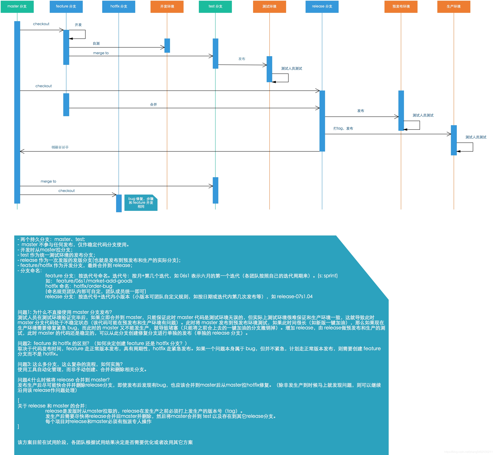

### 开发的环境：
本地环境（dev）、测试环境(boe/test)，生产预览环境(ppe/staging)和正式生产环境(prod)。 

### 泳道
一个服务多个需求同时进行测试，测试人员需要将需求划分到不同的泳道中。  泳道对同一个环境下的服务进行了逻辑隔离。
操作：通过不同的子域名或者特定请求头值（swimlane=xxxx）来区分不同的泳道。
本质：每一个泳道对应一个服务的某个版本，可以把泳道是一个独立的服务器，可以部署前后端资源。

前端静态资源，基于泳道名进行隔离，在资源编译和打包的时候，指定发布的泳道名，然后资源会上传到该泳道对应的静态服务器中：

实现原理：

### git流程

#### github flow

#### gitlab flow

### 如何回滚

